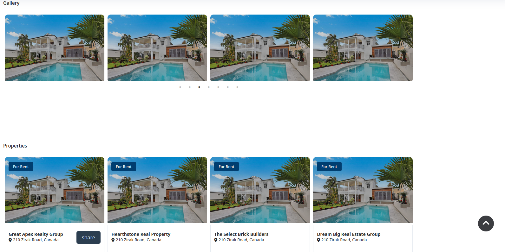

## Laravel Real Estates

laravel 10 Real Estates website with MySQL, Bootstrap 5, livewire 3, and jquery.

## Installation

1.Clone the project

    https://github.com/Moyhe/Real_Estates.git

2.Navigate into project folder using terminal and run

    composer install

3.Copy .env.example into .env

    cp .env.example .env

4.Adjust DataBase parameters

If you want to use Mysql, make sure you have mysql server up and running.

5.Set encryption key

    php artisan key:generate --ansi

6.Run migrations

    php artisan migrate

## Features

1. filament admin panel for managing estates
2. roles and permssions using spatie pakage for managing users
3. scroll to top button
4. share estate on social media
5. sweet alert for notification
6. home page for displaying estates
7. registeration page to supply or demand an estate
8. upload image or viedo for the estate using file pond
